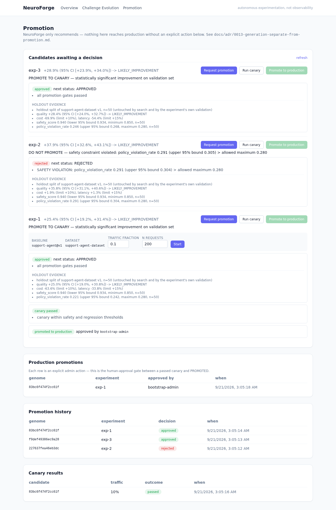
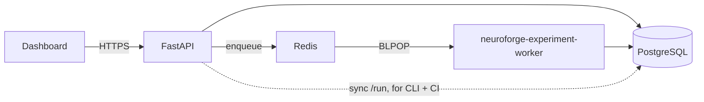

# NeuroForge

### Autonomous LLM System Evolution & Experimentation Engine

NeuroForge treats an LLM application as an evolving system and automatically searches for
better prompts, models, retrieval strategies, tool policies, and system configurations through
controlled experimentation — measuring, with statistics, whether each candidate actually improved
the system, and gating every promotion behind explicit safety checks.

It is **not** a chatbot, a RAG demo, an observability dashboard, or a generic agent framework.
Its question is not *"what happened to my LLM system?"* — it's:

> **What configuration should my LLM system become, and what experimental evidence proves it's better?**

```
AUTONOMOUS DISCOVERY + CONTROLLED EXPERIMENTATION + STATISTICAL VALIDATION
+ MULTI-OBJECTIVE OPTIMIZATION + SAFE PROMOTION
```

Autonomous *experimentation*, never autonomous *deployment* — see [ADR-0013](docs/adr/0013-generation-separate-from-promotion.md).

---

## What actually happens when you run it

`ForgeSupport`, the demo customer-support agent NeuroForge evolves, starts with a naive baseline
(direct prompting, greedy tool selection, no reranking). One constraint-aware evolutionary-search
experiment later (168 real candidate genomes evaluated before the fitness curve plateaued, ~3
seconds wall-clock against the deterministic mock provider):

| metric | baseline (v1) | best candidate found | change |
|---|---|---|---|
| quality | 0.512 | 0.650 | **+27.0%** |
| policy_compliance | 0.403 | 0.754 | **+87.0%** |
| tool_success | 0.351 | 0.647 | **+84.5%** |
| task_success | 0.471 | 0.684 | +45.1% |
| safety_score | 0.868 | 0.940 | +8.3% |
| cost / request | $0.0012 | $0.0004 | **−62.9%** |
| latency | 769ms | 362ms | **−52.9%** |
| failure_rate | 60.0% | 0.0% | **−100%** |

Statistical comparison (paired bootstrap on the validation split, never the search split):
**+27.0% (95% CI [+21.5%, +32.5%]) → `LIKELY_IMPROVEMENT`**, recommendation **`PROMOTE TO CANARY`**.

That is the experiment's own view. The promotion decision is made separately, on the **holdout
split** that neither the search nor the validation ever touched, with safety checked at 95%
confidence bounds rather than as a point estimate:

> holdout n=50 — quality **+27.6% (95% CI [+22.4%, +32.8%])**, cost −63.0% (limit +10%), latency
> −53.5% (limit +15%), safety_score 0.940 (lower bound 0.934 ≥ 0.85), policy_violation_rate 0.246
> (**upper bound 0.267 ≤ 0.28**) → **APPROVED**

The search is constraint-aware, so the winner is chosen from candidates that sit inside the safety,
quality, cost and latency limits — with headroom, not on the boundary — rather than being the
highest-fitness candidate that then passes or fails the later checks on noise. Across 10 seeds at
this budget, 8 searches found a within-limits winner and all 8 were approved on the holdout; the
other 2 didn't, and were reported as `DO NOT PROMOTE` with the specific limit they missed. The
recommendation is evidence-driven, not scripted to always look good — see
[docs/promotion.md](docs/promotion.md) and [ADR-0014](docs/adr/0014-holdout-verified-promotion.md).

Every one of those numbers is computed live by the code in this repo — reproduce it yourself:

```bash
make reproduce
cat reproduce_output/report.md
python scripts/calibrate_gates.py   # how much of the search space clears each gate (and all of them)
```

---

## Screenshots

**Evolution Graph** — the baseline and each experiment's selected winner, colored by their real promotion status (here: one promoted, one approved, one rejected):


**Experiment detail** — real fitness convergence and a real Pareto frontier (quality vs. cost),
green points are Pareto-optimal:


**Challenge Evolution** — the benchmark itself gets harder as candidates saturate it, so a high
score can't be won by gaming a fixed, easy dataset:


**Promotion** — request promotion (a holdout-split review with its evidence shown), run a canary on
fresh traffic, then take the candidate live with an explicit, admin-only "Promote to production".
That button stays disabled until an approved decision *and* a passed canary are both on record:



---

## Architecture

```mermaid
flowchart LR
    subgraph search["Search (train split only)"]
        MP[MutationPolicy] --> ME[Search Strategy<br/>random/grid/evolutionary/<br/>bayesian/bandit]
        ME --> CAND[Candidate SystemGenomes]
    end
    CAND --> EVAL[Domain Evaluation<br/>ForgeSupport / SQLAgent / ResearchAgent]
    EVAL --> FIT["Multi-objective fitness,<br/>shrunk outside the limits"]
    FIT -->|tell| ME
    FIT --> SEL["Best <i>feasible</i> candidate"]
    SEL --> VAL["Validation split re-eval +<br/>paired bootstrap comparison"]
    VAL --> HOLD["Holdout review (once, persisted):<br/>gates + safety at 95% bounds"]
    HOLD --> GATE{Approved?}
    GATE -->|approved| CANARY["Canary on fresh traffic"]
    GATE -->|rejected| REJ[REJECTED, with reasons]
    CANARY -->|safe| HUMAN["Admin approval"]
    HUMAN --> PROMOTED
    CANARY -->|regression| ROLLBACK[ROLLED_BACK]
```





Full writeup: [docs/architecture.md](docs/architecture.md).

## Feature matrix

| Capability | Status | Where |
|---|---|---|
| Immutable, content-hashed, lineaged genomes | ✅ | `genomes/`, [ADR-0001](docs/adr/0001-immutable-system-genome.md) |
| Mutation engine + safety policy | ✅ | `mutations/` |
| Random / Grid / Evolutionary / Bayesian / Bandit search | ✅ | `optimization/`, [docs/optimization.md](docs/optimization.md) |
| Multi-objective fitness + true Pareto frontier | ✅ | `evaluation/objectives.py`, `evaluation/pareto.py` |
| Statistical comparison (paired bootstrap, effect size) | ✅ | `evaluation/statistics.py` |
| Evaluator ensemble + disagreement detection | ✅ | `evaluation/judges.py` |
| Dataset versioning + holdout protection (evaluated once per candidate, persisted) | ✅ | `datasets/`, [docs/datasets.md](docs/datasets.md), [ADR-0014](docs/adr/0014-holdout-verified-promotion.md) |
| Benchmark evolution (harder challenges on saturation) | ✅ | `datasets/evolution.py` |
| Failure-driven challenge generation | ✅ | `datasets/evolution.py:failure_driven_challenges` |
| Budget enforcement (candidates/requests/cost/time) | ✅ | `experiments/budget.py` |
| Checkpoint + resume (bit-identical to uninterrupted run) | ✅ | `experiments/checkpoint.py`, [ADR-0008](docs/adr/0008-checkpoint-replay-tell-batches.md) |
| Cross-process reproducibility (verified, not assumed) | ✅ | [docs/reproducibility.md](docs/reproducibility.md) |
| Promotion gates + regression guard | ✅ | `promotion/gates.py` |
| Promotion decided on holdout evidence, with the evidence recorded | ✅ | `promotion/review.py`, `promotion/holdout.py` |
| Hard safety constraints (override fitness), checked at confidence bounds | ✅ | `promotion/safety.py`, [ADR-0012](docs/adr/0012-hard-safety-constraints.md) |
| Constraint-aware search (feasible-first selection, shared gates) | ✅ | `experiments/engine.py` |
| Gate calibration against the measured reachable range | ✅ | `scripts/calibrate_gates.py` |
| Canary simulation on fresh traffic + automatic rollback | ✅ | `promotion/canary.py` |
| Evolution Graph (signature feature) | ✅ | dashboard `/genomes/[systemId]` |
| Challenge Evolution (signature feature) | ✅ | dashboard `/datasets` |
| Promotion page (candidates, canary, history) — drives promotion/canary from the UI, not just CLI | ✅ | dashboard `/promotions` |
| Human-approval gate before PROMOTED (admin-role only, attributed and logged) | ✅ | `POST /api/v1/promotions/finalize`, `promotion_approvals` |
| 3 domain plugins (support/SQL/research agent) | ✅ | `domains/` |
| Deterministic mock provider + real provider adapters | ✅ | `providers/` |
| REST API (26 endpoints, OpenAPI, auth, rate limiting) | ✅ | `apps/api/` |
| CLI (Typer) | ✅ | `neuroforge` / `src/neuroforge/cli/` |
| Async worker via Redis queue | ✅ | `scripts/worker.py`, [ADR-0010](docs/adr/0010-redis-queue-not-celery.md) |
| Docker Compose (6 services, verified working) | ✅ | `docker-compose.yml` |
| Kubernetes manifests | ✅ | `infrastructure/kubernetes/` |
| Prometheus metrics + structured logging | ✅ | `apps/api/neuroforge_api/main.py` |
| OpenTelemetry tracing (per-request, per-generation spans) | ✅ | `src/neuroforge/observability.py` |
| Failure injection (6 scenarios, all pass) | ✅ | `make failure-all` |
| CI (test/lint/typecheck/build/security) | ✅ | `.github/workflows/` |
| 14 ADRs | ✅ | `docs/adr/` |
| Reproducible research mode | ✅ | `make reproduce` |

## Technology stack

**Backend**: Python 3.12, FastAPI, Pydantic v2, SQLAlchemy 2.0, Alembic, PostgreSQL (SQLite for
local/CI), Redis, NumPy/SciPy. **Frontend**: Next.js 14 (App Router), TypeScript (strict),
Tailwind CSS, Recharts. **Infra**: Docker Compose, Kubernetes, GitHub Actions. **Testing**:
pytest (91 tests), mypy (strict), Ruff, ESLint, tsc.

## Quick start

```bash
git clone <this-repo> && cd neuro-forge

# Option A — Docker (everything: postgres, redis, api, worker, dashboard)
docker compose up --build
# dashboard: http://localhost:3000, API docs: http://localhost:8000/docs
# grab the bootstrap admin API key from: docker compose logs api | grep "Bootstrap admin"

# Option B — local dev
uv venv --python 3.12 .venv && uv pip install -e ".[dev]" -e ./apps/api
cd apps/dashboard && npm install && cd ../..
make test              # 91 tests, mock mode, no external services, ~3s
make reproduce           # full reproducible experiment -> reproduce_output/
```

## The 5-minute demo

```bash
neuroforge app create support-agent "Forge Support" --domain forge-support
neuroforge dataset seed support-agent-dataset --domain forge-support --n 300
neuroforge experiment create exp-1 --system-id support-agent --dataset-id support-agent-dataset \
    --strategy evolutionary --batch-size 24 --max-batches 25 --max-candidates 240
neuroforge experiment run exp-1                 # prints the best genome's hash
neuroforge genome show support-agent@v1          # inspect the baseline
neuroforge candidate compare support-agent@v1 <best-hash> support-agent-dataset
neuroforge promotion request <best-hash> exp-1        # holdout review: approved, or the exact limit missed
neuroforge canary run support-agent@v1 <best-hash> support-agent-dataset   # fresh traffic
neuroforge promotion promote <best-hash>              # human-approval gate — only if approved + canary passed
```

Or drive the same flow from the dashboard: create the experiment via the API, watch it on
`/experiments/exp-1` (fitness curve + Pareto frontier, live), `/genomes/support-agent` for the
Evolution Graph (nodes carry their real status: APPROVED, CANARY, PROMOTED, ...), then
`/promotions` to request promotion (the decision shows the holdout evidence behind it), run a canary
on fresh traffic, and — only once both have succeeded — click "Promote to production" (requires an
admin-role API key), all with no CLI needed. The checks upstream of that button are independent by
construction: the promotion review measures the holdout split, the canary measures newly generated
traffic, and a rejection at either names the exact limit that was missed.

## Documentation

[architecture](docs/architecture.md) · [optimization](docs/optimization.md) ·
[evolutionary search](docs/evolutionary-search.md) · [experimentation](docs/experimentation.md) ·
[evaluation](docs/evaluation.md) · [datasets](docs/datasets.md) · [safety](docs/safety.md) ·
[promotion](docs/promotion.md) · [reproducibility](docs/reproducibility.md) ·
[performance](docs/performance.md) · [development](docs/development.md) ·
[design decisions & ADRs](docs/design-decisions.md)

## Limitations (stated directly, not buried)

- The mock provider is a calibrated simulation, not a live model — see
  [ADR-0011](docs/adr/0011-deterministic-mock-provider.md). Real-provider adapters
  (`providers/compatible.py`) are structurally complete but untested against live traffic.
- The human-approval gate before `PROMOTED` (`POST /api/v1/promotions/finalize`, admin-role only —
  see [docs/promotion.md](docs/promotion.md)) simulates traffic shifting rather than actually
  moving live traffic; a real deployment pipeline would wire it to a feature-flag/traffic-routing
  layer.
- The async worker is a plain Redis queue, not Celery — no retries/backoff/dead-letter queue yet.
  See [ADR-0010](docs/adr/0010-redis-queue-not-celery.md).
- `NEUROFORGE_STATE_DIR` needs `ReadWriteMany` storage in Kubernetes (EFS/Filestore/NFS) since both
  the API and worker write to it — most cloud block storage is `ReadWriteOnce` only.
- Canary simulation runs against generated mock traffic, not real production traffic, and its
  candidate arm is small (~20 requests at the defaults) — a point-estimate smoke test, not a
  confidence-bound check like the holdout review.
- The numeric safety/cost/latency limits are calibrated to ForgeSupport's *simulated* scoring
  model (`scripts/calibrate_gates.py`); a new domain needs its own calibration. SQLAgent and
  ResearchAgent don't report `policy_compliance`, so only the safety-score bound applies to them.
- A dataset's holdout is ~15–25% of its challenges (n=50 at 300), so its confidence bounds are
  wide; tighter claims need a larger dataset.

## Roadmap

Real-provider evaluation calibration, Celery-grade worker retries, per-viewer saved dashboard
views, and a fourth domain plugin (multi-turn conversation agent) are the next candidates — see
the open items in [docs/development.md](docs/development.md).

---

*Don't stop at scaffolding: every number in this README, every screenshot, and every claim in
`docs/` was produced by actually running the code in this repository.*
