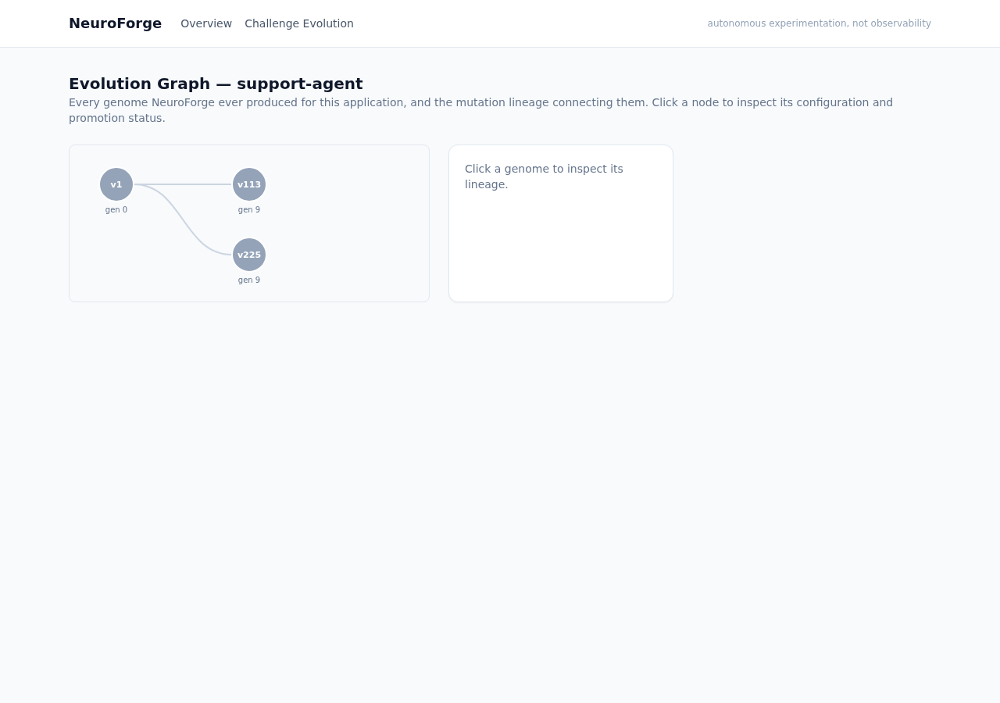
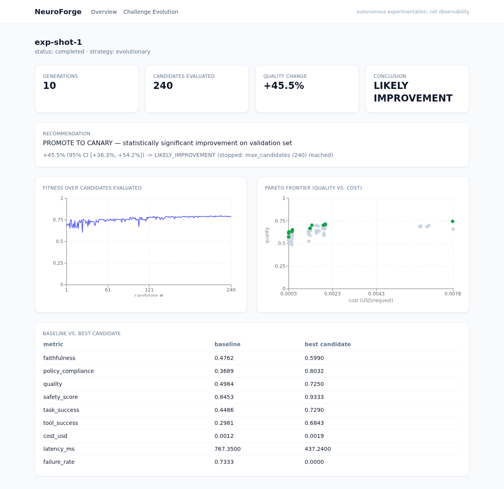
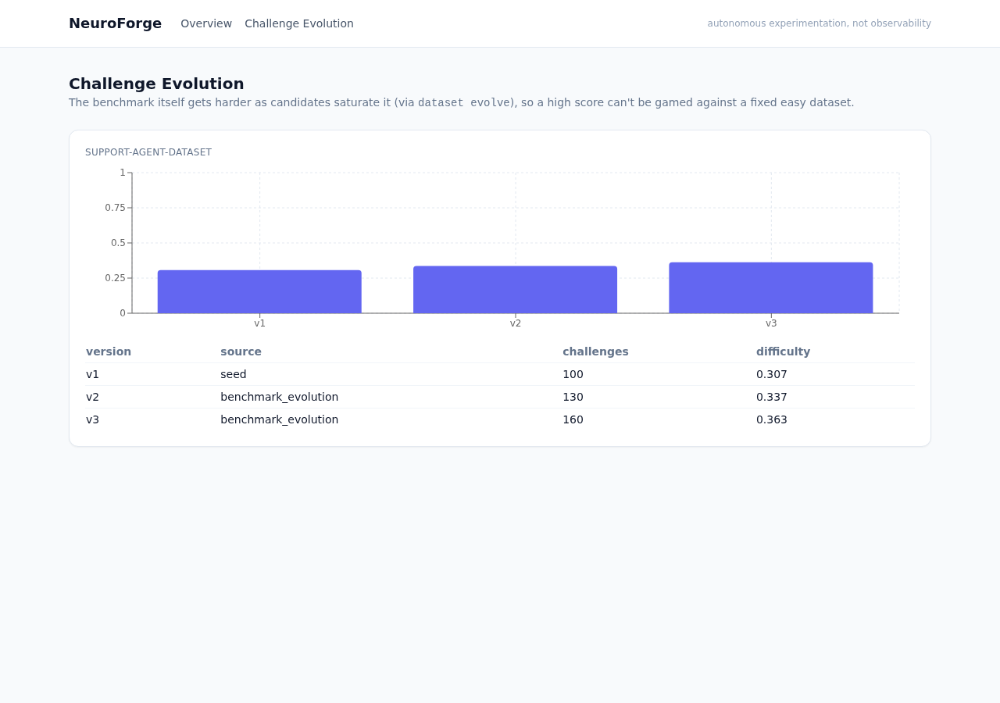
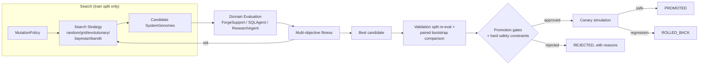
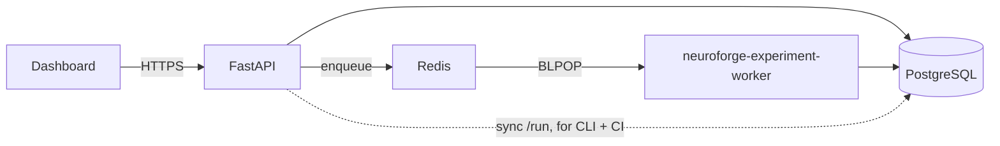

# NeuroForge

### Autonomous LLM System Evolution & Experimentation Engine

NeuroForge treats an LLM application as an evolving system and automatically searches for
better prompts, models, retrieval strategies, tool policies, and system configurations through
controlled experimentation — measuring, with statistics, whether each candidate actually improved
the system, and gating every promotion behind explicit safety checks.

It is **not** a chatbot, a RAG demo, an observability dashboard, or a generic agent framework.
Its question is not *"what happened to my LLM system?"* — it's:

> **What configuration should my LLM system become, and what experimental evidence proves it's better?**

```
AUTONOMOUS DISCOVERY + CONTROLLED EXPERIMENTATION + STATISTICAL VALIDATION
+ MULTI-OBJECTIVE OPTIMIZATION + SAFE PROMOTION
```

Autonomous *experimentation*, never autonomous *deployment* — see [ADR-0013](docs/adr/0013-generation-separate-from-promotion.md).

---

## What actually happens when you run it

`ForgeSupport`, the demo customer-support agent NeuroForge evolves, starts with a naive baseline
(direct prompting, greedy tool selection, no reranking). One evolutionary-search experiment later
(240 real candidate genomes evaluated, ~1 second wall-clock against the deterministic mock
provider):

| metric | baseline (v1) | best candidate found | change |
|---|---|---|---|
| quality | 0.498 | 0.725 | **+45.5%** |
| policy_compliance | 0.369 | 0.803 | **+117.7%** |
| tool_success | 0.298 | 0.684 | **+130%** |
| safety_score | 0.845 | 0.933 | +10.4% |
| cost / request | $0.0012 | $0.0019 | +58% |
| latency | 767ms | 437ms | **−43%** |
| failure_rate | 73.3% | 0.0% | **−100%** |

Statistical comparison (paired bootstrap on the held-out validation split, never the search
split): **+45.5% (95% CI [+36.3%, +54.2%]) → `LIKELY_IMPROVEMENT`**, recommendation
**`PROMOTE TO CANARY`**.

Every one of those numbers is computed live by the code in this repo — reproduce it yourself:

```bash
make reproduce
cat reproduce_output/report.md
```

Different seeds and objective weights sometimes land on `DO NOT PROMOTE` instead (a candidate that
improves quality but crosses a safety threshold gets rejected, full stop — see
[docs/safety.md](docs/safety.md)). That's the point: the recommendation is evidence-driven, not
scripted to always look good.

---

## Screenshots

**Evolution Graph** — every genome ever produced for an application, with real mutation lineage:



**Experiment detail** — real fitness convergence and a real Pareto frontier (quality vs. cost),
green points are Pareto-optimal:



**Challenge Evolution** — the benchmark itself gets harder as candidates saturate it, so a high
score can't be won by gaming a fixed, easy dataset:



---

## Architecture





Full writeup: [docs/architecture.md](docs/architecture.md).

## Feature matrix

| Capability | Status | Where |
|---|---|---|
| Immutable, content-hashed, lineaged genomes | ✅ | `genomes/`, [ADR-0001](docs/adr/0001-immutable-system-genome.md) |
| Mutation engine + safety policy | ✅ | `mutations/` |
| Random / Grid / Evolutionary / Bayesian / Bandit search | ✅ | `optimization/`, [docs/optimization.md](docs/optimization.md) |
| Multi-objective fitness + true Pareto frontier | ✅ | `evaluation/objectives.py`, `evaluation/pareto.py` |
| Statistical comparison (paired bootstrap, effect size) | ✅ | `evaluation/statistics.py` |
| Evaluator ensemble + disagreement detection | ✅ | `evaluation/judges.py` |
| Dataset versioning + holdout protection | ✅ | `datasets/`, [docs/datasets.md](docs/datasets.md) |
| Benchmark evolution (harder challenges on saturation) | ✅ | `datasets/evolution.py` |
| Failure-driven challenge generation | ✅ | `datasets/evolution.py:failure_driven_challenges` |
| Budget enforcement (candidates/requests/cost/time) | ✅ | `experiments/budget.py` |
| Checkpoint + resume (bit-identical to uninterrupted run) | ✅ | `experiments/checkpoint.py`, [ADR-0008](docs/adr/0008-checkpoint-replay-tell-batches.md) |
| Cross-process reproducibility (verified, not assumed) | ✅ | [docs/reproducibility.md](docs/reproducibility.md) |
| Promotion gates + regression guard | ✅ | `promotion/gates.py` |
| Hard safety constraints (override fitness) | ✅ | `promotion/safety.py`, [ADR-0012](docs/adr/0012-hard-safety-constraints.md) |
| Canary simulation + automatic rollback | ✅ | `promotion/canary.py` |
| Evolution Graph (signature feature) | ✅ | dashboard `/genomes/[systemId]` |
| Challenge Evolution (signature feature) | ✅ | dashboard `/datasets` |
| 3 domain plugins (support/SQL/research agent) | ✅ | `domains/` |
| Deterministic mock provider + real provider adapters | ✅ | `providers/` |
| REST API (17 endpoints, OpenAPI, auth, rate limiting) | ✅ | `apps/api/` |
| CLI (Typer) | ✅ | `neuroforge` / `src/neuroforge/cli/` |
| Async worker via Redis queue | ✅ | `scripts/worker.py`, [ADR-0010](docs/adr/0010-redis-queue-not-celery.md) |
| Docker Compose (6 services, verified working) | ✅ | `docker-compose.yml` |
| Kubernetes manifests | ✅ | `infrastructure/kubernetes/` |
| Prometheus metrics + structured logging | ✅ | `apps/api/neuroforge_api/main.py` |
| OpenTelemetry tracing (per-request, per-generation spans) | ✅ | `src/neuroforge/observability.py` |
| Failure injection (6 scenarios, all pass) | ✅ | `make failure-all` |
| CI (test/lint/typecheck/build/security) | ✅ | `.github/workflows/` |
| 12 ADRs | ✅ (13) | `docs/adr/` |
| Reproducible research mode | ✅ | `make reproduce` |

## Technology stack

**Backend**: Python 3.12, FastAPI, Pydantic v2, SQLAlchemy 2.0, Alembic, PostgreSQL (SQLite for
local/CI), Redis, NumPy/SciPy. **Frontend**: Next.js 14 (App Router), TypeScript (strict),
Tailwind CSS, Recharts. **Infra**: Docker Compose, Kubernetes, GitHub Actions. **Testing**:
pytest (75 tests), mypy (strict), Ruff, ESLint, tsc.

## Quick start

```bash
git clone <this-repo> && cd neuro-forge

# Option A — Docker (everything: postgres, redis, api, worker, dashboard)
docker compose up --build
# dashboard: http://localhost:3000, API docs: http://localhost:8000/docs
# grab the bootstrap admin API key from: docker compose logs api | grep "Bootstrap admin"

# Option B — local dev
uv venv --python 3.12 .venv && uv pip install -e ".[dev]" -e ./apps/api
cd apps/dashboard && npm install && cd ../..
make test              # 75 tests, mock mode, no external services, ~3s
make reproduce           # full reproducible experiment -> reproduce_output/
```

## The 5-minute demo

```bash
neuroforge app create support-agent "Forge Support" --domain forge-support
neuroforge dataset seed support-agent-dataset --domain forge-support --n 100
neuroforge experiment create exp-1 --system-id support-agent --dataset-id support-agent-dataset \
    --strategy evolutionary --batch-size 24 --max-batches 25 --max-candidates 240
neuroforge experiment run exp-1                 # watch generations evolve, live
neuroforge genome show support-agent@v1          # inspect the baseline
neuroforge candidate compare support-agent@v1 <best-hash> support-agent-dataset
neuroforge canary run support-agent@v1 <best-hash> support-agent-dataset
neuroforge promotion request <best-hash> exp-1        # PROMOTE or a specific rejection reason
```

Or drive the same flow from the dashboard: create the experiment via the API, watch it on
`/experiments/exp-1` (fitness curve + Pareto frontier, live), then `/genomes/support-agent` for
the Evolution Graph.

## Documentation

[architecture](docs/architecture.md) · [optimization](docs/optimization.md) ·
[evolutionary search](docs/evolutionary-search.md) · [experimentation](docs/experimentation.md) ·
[evaluation](docs/evaluation.md) · [datasets](docs/datasets.md) · [safety](docs/safety.md) ·
[promotion](docs/promotion.md) · [reproducibility](docs/reproducibility.md) ·
[performance](docs/performance.md) · [development](docs/development.md) ·
[design decisions & ADRs](docs/design-decisions.md)

## Limitations (stated directly, not buried)

- The mock provider is a calibrated simulation, not a live model — see
  [ADR-0011](docs/adr/0011-deterministic-mock-provider.md). Real-provider adapters
  (`providers/compatible.py`) are structurally complete but untested against live traffic.
- No human-approval gate between `APPROVED` and `PROMOTED` — a real deployment pipeline should add
  one. See [docs/development.md](docs/development.md).
- The async worker is a plain Redis queue, not Celery — no retries/backoff/dead-letter queue yet.
  See [ADR-0010](docs/adr/0010-redis-queue-not-celery.md).
- `NEUROFORGE_STATE_DIR` needs `ReadWriteMany` storage in Kubernetes (EFS/Filestore/NFS) since both
  the API and worker write to it — most cloud block storage is `ReadWriteOnce` only.
- Canary simulation runs against mock/replay traffic, not real production traffic.

## Roadmap

Real-provider evaluation calibration, a human-approval promotion step, Celery-grade worker
retries, per-viewer saved dashboard views, and a fourth domain plugin (multi-turn conversation
agent) are the next candidates — see the open items in [docs/development.md](docs/development.md).

---

*Don't stop at scaffolding: every number in this README, every screenshot, and every claim in
`docs/` was produced by actually running the code in this repository.*
